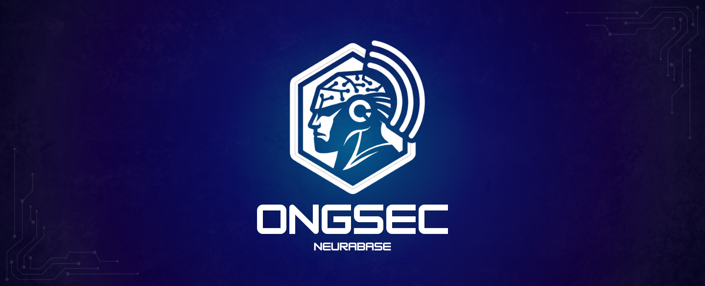

<h3 align="center">
Startup de Cibersegurança e Conformidade LGPD para o Terceiro Setor e Pequenos Negócios
</h3>
Integrantes (Equipe NeuraBase)

    

    

    

<b>Lucas J.</b> | <b>Marco A.</b> | <b>Nicolas M.</b> | <b>Tainara F.</b>

O Problema e Motivação
Comércios locais e associações sem fins lucrativos (ONGs) lidam diariamente com dados altamente sensíveis — desde registros de doadores e fichas médicas até endereços de populações em extrema vulnerabilidade social. No entanto, por restrições orçamentárias e falta de equipes técnicas, essas entidades recorrem a processos inseguros (troca de documentos via aplicativos de mensagem sem criptografia, planilhas compartilhadas sem controle de acesso ou senhas padrão).
Com a vigência da Lei Geral de Proteção de Dados (LGPD - Lei nº 13.709/2018) e o avanço das sanções operacionais pela ANPD, a ausência de higiene cibernética expõe essas instituições a riscos severos de vazamento de dados, perda de credibilidade e inviabilização de suas atividades.
Impacto Social Esperado
Democratizar o acesso à segurança da informação e à conformidade regulatória no Terceiro Setor por meio de uma plataforma automatizada, didática e de baixo custo.
 * Beneficiários: Gestores de ONGs, pequenos comerciantes, doadores e assistidos por projetos sociais.
 * Resultados Esperados: Mitigação do risco de vazamento de dados sensíveis de populações vulneráveis, aumento da transparência institucional e fortalecimento da confiança de doadores.
 * Métricas de Impacto: Número de entidades auditadas, índice médio de evolução no score de conformidade e total de selos válidos emitidos e verificados publicamente.
A Solução e História de Uso
O ONGSec atua como um consultor de segurança automatizado e emissor de selos digitais de conformidade cibernética.
Exemplo Prático (Associação Cuidar):
 * Diagnóstico Automatizado: Dona Maria, diretora de um abrigo infantil, acessa o Painel de Gestão (BFF Web) e responde a um questionário adaptado de higiene digital.
 * Plano de Ação Tático: O sistema processa as vulnerabilidades e gera um plano de tarefas de remediação prioritárias.
 * Automação com IA (RAG + LangChain): Ao executar a tarefa "Elaborar Política de Privacidade", Dona Maria aciona o Assistente IA. O modelo recupera diretrizes oficiais da ANPD (RAG) e consulta as configurações reais da ONG no sistema via tools internas para gerar a política personalizada.
 * Validação e Selo Digital: Após a resolução das pendências e atualização do score, o sistema aciona uma orquestração SAGA para emitir o Selo Digital de Conformidade.
 * Transparência Pública: Semanas depois, um doador aciona o Portal Público de Selos (BFF Público) para validar a reputação digital da ONG. A consulta utiliza uma arquitetura CQRS otimizada para respostas instantâneas.
Esboço da Arquitetura Distribuída
O sistema utiliza o padrão de Microsserviços com Database per Service (cada serviço possui sua própria instância isolada de banco de dados PostgreSQL no Docker).
       ┌────────────────────────┐         ┌──────────────────┐
       │  Cliente Web (Gestão)  │ ─────>  │  BFF 1: Gestão   │
       └────────────────────────┘         └────────┬─────────┘
                                                   │
       ┌────────────────────────┐         ┌────────▼─────────┐
       │ Cliente Web (Público)  │ ─────>  │  BFF 2: Público  │  ───> [ API Gateway ] ──> [ Microsserviços ]
       └────────────────────────┘         └──────────────────┘

| Microsserviço de Domínio | Responsabilidade Principal | Tecnologia de Banco de Dados | Justificativa Arquitetural |
|---|---|---|---|
| 1. Entidades (org-service) | Gestão de cadastros de ONGs, usuários, perfis e autenticação. | PostgreSQL (Instância 1) | Garantia ACID para dados estruturados de contas e acessos. |
| 2. Auditoria (audit-service) | Diagnósticos de segurança, checklists dinâmicos e cálculo de risco. | PostgreSQL (Instância 2) | Uso de colunas JSONB nativas para suportar esquemas flexíveis de questionários. |
| 3. Remediação (task-service) | Ciclo de vida do plano de ação (tarefas, prazos e soluções). | PostgreSQL (Instância 3) | Controle estrito de estados e relacionamentos de tarefas. |
| 4. Certificação (badge-service) | Emissão, validação e publicação de Selos Digitais de Conformidade. | PostgreSQL (Instância 4) | Separação CQRS mantendo consistência e leitura otimizada no modelo relacional. |
Padrões e Requisitos Transversais
 * SAGA Orquestrada (Transação Distribuída): O fluxo de Solicitação e Emissão de Selo cruza os serviços Audit -> Task -> Badge. Em caso de reabertura de pendência ou não conformidade, transações compensatórias revertem o status da solicitação.
 * CQRS: O badge-service separa o modelo de escrita do modelo de consulta pública do Portal de Selos, garantindo alta disponibilidade sem sobrecarregar a base principal.
 * Inteligência Artificial: Módulo de RAG alimentado por guias oficiais, integrado via LangChain com consulta a tools internas do sistema.
Fundamentação e Referências Sólidas
 * ANPD (Autoridade Nacional de Proteção de Dados): Guia Orientativo para Agentes de Tratamento de Pequeno Porte. Brasília: ANPD, 2021.
 * CERT.br (Centro de Estudos, Resposta e Tratamento de Incidentes de Segurança no Brasil): Cartilha de Segurança para a Internet. São Paulo: NIC.br, 2023.
 * CIS (Center for Internet Security): CIS Critical Security Controls Version 8 — Implementation Group 1 (IG1). CIS, 2021.
 * SEBRAE: Guia Prático de Adequação à LGPD para Micro e Pequenas Empresas. Serviço Brasileiro de Apoio às Micro e Pequenas Empresas, 2022.
Instruções para Execução Local
> Nota: Ambiente inicial de desenvolvimento. A orquestração completa em containers Docker e Kubernetes será disponibilizada nas etapas 3 e 4.
> 
Pré-requisitos
 * Git
 * Docker Desktop (v24.0+) e docker-compose
Passo a Passo
# 1. Clonar o repositório
git clone https://github.com/nicolas-mtheus/gcc129-ongsec-neurabase.git

# 2. Acessar o diretório do projeto
cd gcc129-ongsec-neurabase

# 3. Subir os serviços e bancos de dados isolados (Em desenvolvimento)
docker-compose up -d
